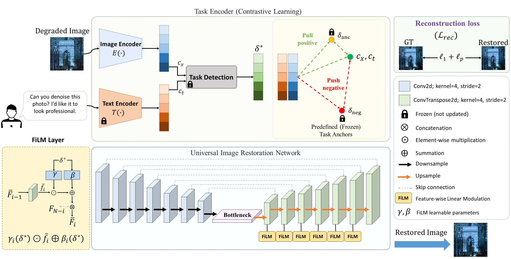

# if you see this message, It means we are uploading our source code and checkpoints. Please wait....
# TRNet (Tell and Restore Network)
## Contrastive Anchor-Based Task Representation for Instruction-Guided All-in-One Image Restoratio
### Authors: Ako Bartani, Omed Sedeeq Ahmad, Mohammed Shamsaddin Qadir, Karwan Ahmed Abdullah, and Fardin Akhlaghian Tab



## Requirements
```
-PyTorch (CUDA-enabled for GPU training)
-torchvision
-numpy, scipy, pillow
-opencv-python
-tqdm, matplotlib
```
## Dataset preparation
We used seven degraded image dataset: deraining, dehazing, denoising, low-light image enhancement, underwater image restoration, deblurring, and image super-resolution. The both train and test image dataset are available at [Download Link](https://www.kaggle.com/datasets/akobartani/all-in-one-image-restoration). 

Moreover, you can find human instructions (train and test) and frozen task representation in the 'data' folder.


## Test Model
To test model on 7 tasks:

1: ensure that the model checkpoints are available at the "checkpoints/" folder.

- Generator checkpoints: [download link](https://drive.google.com/file/d/1-hzF56QsA9qD8ltUeAZiNLTdXKJ6wpNN/view?usp=sharing)
- Image encoder checkpoints: [download link](https://drive.google.com/file/d/145uC2VZG0qn7pHtTjqQj3TQeIQ8gEPWO/view?usp=sharing)
- Text encoder checkpoints: [download link](https://drive.google.com/file/d/184QG0ONHmuz9601kOZmlU-Xg6hIJjs7k/view?usp=sharing)

2: at the config.py:
```
LOAD_checkpoints_Image_Encoder = True
TEXT_MODEL_checkpoints = True
GEN_checkpoints = True
```

3: Please set the degraded image path, instruction, and save path in the test.py
```
save_path = "save path result"
Image_path = "your degraded image path"
your_instruction = "write your instruction"
```

4: run the "test.py".

## Citation

The citation information will be included after the published.


## Contacts
For any inquiries contact Ako Bartani: <a href="mailto:a.bartani@uok.ac.ir">a.bartani [at] uok.ac.ir</a>
